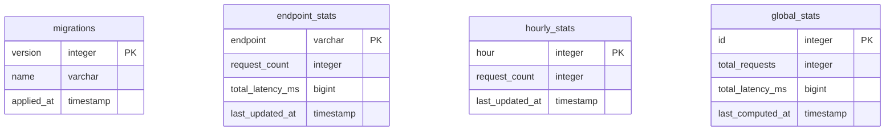

# SWStarter

A Star Wars search application with a React frontend and Node.js Backend-for-Frontend (BFF).

## Architecture Overview

```
Frontend (React/Vite) → Backend (Fastify BFF) → Star Wars API
                              ↓
                    PostgreSQL + Redis
                              ↓
                      Worker (BullMQ)
```

- **Frontend**: React app served by Nginx
- **Backend**: BFF that proxies SWAPI, emits events to queue
- **Worker**: Processes events every 5 minutes, updates stats
- **PostgreSQL**: Stores aggregated statistics
- **Redis**: Queue storage for BullMQ

## Database Schema



**Tables:**

- `migrations`: Tracks applied database migrations
- `endpoint_stats`: Aggregated request counts and latency per API endpoint
- `hourly_stats`: Aggregated request counts per hour (0-23)
- `global_stats`: Global aggregated statistics (single row with id=1)

## Running Locally

### With Docker (Recommended)

Docker handles all dependencies automatically. No need to install Node.js or run npm install.

```bash
docker-compose up --build -d
```

Wait ~30 seconds for all services to start.

### Without Docker

If you prefer to run services locally:

1. Install dependencies:

   ```bash
   cd backend && npm install
   cd ../swstarter-front && npm install
   ```

2. Start PostgreSQL and Redis (via Docker or locally)

3. Follow the setup instructions in `backend/README.md` and `swstarter-front/README.md`

## Services and Ports

| Service    | Port | URL                        |
| ---------- | ---- | -------------------------- |
| Frontend   | 80   | http://localhost           |
| Backend    | 3001 | http://localhost:3001      |
| Swagger    | 3001 | http://localhost:3001/docs |
| PostgreSQL | 5432 | -                          |
| Redis      | 6379 | -                          |

## Statistics

API requests emit events to a queue. Every 5 minutes, the worker processes queued events and updates aggregated statistics in PostgreSQL. The `/api/stats` endpoint reads precomputed values.

## Stop and Reset

```bash
# Stop all services
docker-compose down

# Stop and remove all data (reset database)
docker-compose down -v
```
